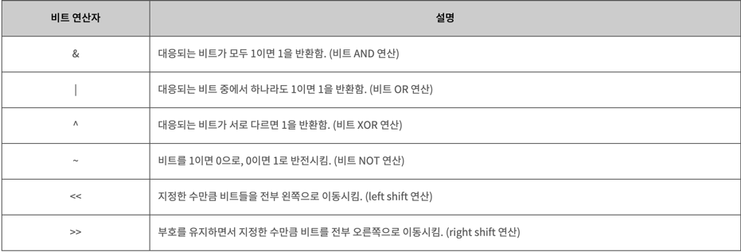

# 비트마스크
사실 알고리즘이라고는 할 수 없고 bit를 이용한 기술이라고 보는게 더 맞을 거 같다.

> 비트란 컴퓨터에서 사용되는 데이터의 최소 단위이자 이진수 0, 1이다.

## 장점
- 공간의 활용을 효율적으로 할 수 있다.
- 정수로 표현할 수 있다.

## 단점
- 장점이자 단점이지만 정수로밖에 표현할 수 없다.

## 비트의 연산

> [이미지 출처](tcpschool.com/c/c_operator_bitwise)

### 검사
AND 연산을 이용해 해당 자리수에 값이 있는지 검사

S & (1 << x)
* S에 x가 있는지 검사
* 해당 자릿수가 1인 값 x에 숫자 S와 AND 연산을 하면 해당 자리수가 존재하지 않으면 0이고 존재하면 0이 아닐 것이다.

### 추가
OR 연산을 이용해 해당 자리수에 값을 추가한다.

S | (1 << x)
* S에 x를 추가
* 해당 자릿수가 1인 값 x에 숫자 S와 OR 연산을 하면 해당 자릿수는 무조건 1이 되므로 추가가 가능하다.

### 제거
XOR 연산이나 AND 연산으로 해당 값을 제거할 수 있다.

S & ~(1 << x)
* S와 x의 자리가 1인 비트를 NOT 연산한 값을 AND 연산
* x의 자리가 1인 비트의 NOT 연산이면 해당 자리수만 0이 된다. 여기에 AND 연산을 하면 무조건 해당 자리수는 0이 된다.

### 토글
특정 비트를 반대로 바꾸는 것
S ^ (1 << x)
* S와 x의 자리가 1인 수를 토글 하면 현재 값고 반대로 나온다.
* S의 x자리수가 0이면 값이 다르므로 1, 1이면 값이 같으므로 0

### 비트 연산의 우선 순위
비트 연산의 우선순위가 존재하지만 외우기보단 괄호를 사용해서 우선순위를 정하는 것이 좋다.

